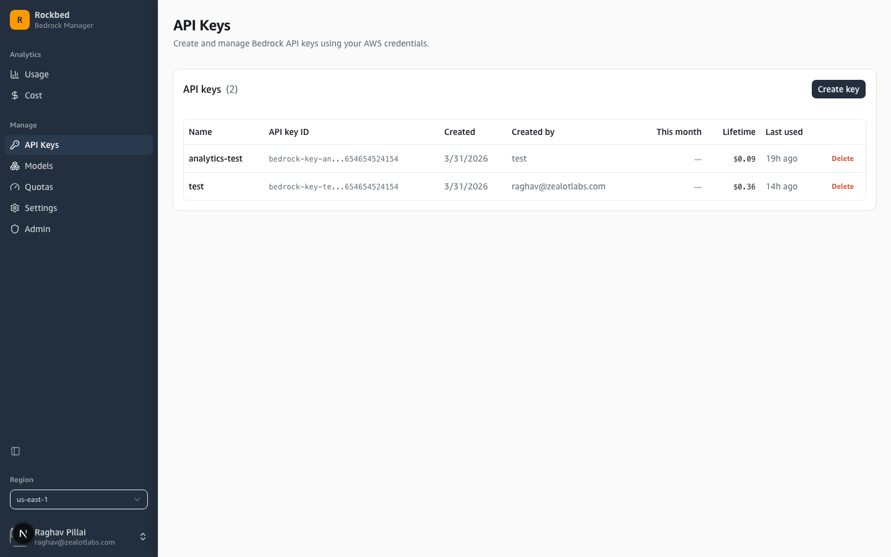

# Rockbed

Self-hosted Bedrock API key management, usage tracking, and cost monitoring.



## What it does

Rockbed gives your team a web UI for provisioning AWS Bedrock API keys (bearer tokens), seeing who's using what, and keeping an eye on costs. No more digging through the AWS console.

- **API keys** — Create and delete Bedrock keys with optional expiration. Each key tracks who created it, how much it's cost, and when it was last used.
- **Usage** — Daily token usage charts from CloudWatch Logs Insights. Group by model, API key, or user.
- **Cost** — Estimated cost breakdowns covering Claude, Llama, Mistral, Nova, and Cohere pricing.
- **Model catalog** — Browse available Bedrock models. Filter by provider, modality, inference type. Favorite the ones you care about.
- **Quotas** — TPM/RPM limits with links to request increases directly in AWS.
- **Admin** — Manage users, restrict email domains, pick which regions are available, toggle invocation logging.

## Setup

You need AWS credentials with IAM/Bedrock permissions and a Google OAuth client.

```bash
git clone https://github.com/raghavpillai/rockbed.git
cd rockbed
cp .env.docker.example .env.docker
```

Fill in `.env.docker` with your credentials, then:

```bash
docker compose up --build
```

Open [localhost:3000](http://localhost:3000), sign in with Google, then hit `/admin` and enter your admin password.

## Google OAuth

1. [Google Cloud Console](https://console.cloud.google.com/apis/credentials) — create an OAuth 2.0 Client ID (Web application)
2. Authorized redirect URI: `http://localhost:3000/api/auth/callback/google`
3. Paste the Client ID and Secret into `.env.docker`

## AWS permissions

Your AWS credentials need:

- `iam:CreateUser`, `iam:DeleteUser`, `iam:AttachUserPolicy`, `iam:DetachUserPolicy`
- `iam:CreateServiceSpecificCredential`, `iam:DeleteServiceSpecificCredential`, `iam:ListServiceSpecificCredentials`
- `iam:TagUser`, `iam:ListUserTags`, `iam:ListUsers`
- `bedrock:ListFoundationModels`, `bedrock:GetFoundationModel`
- `bedrock:GetModelInvocationLoggingConfiguration`, `bedrock:PutModelInvocationLoggingConfiguration`
- `servicequotas:ListServiceQuotas`
- `logs:CreateLogGroup`, `logs:StartQuery`, `logs:GetQueryResults`, `logs:DescribeLogStreams`
- `sts:GetCallerIdentity`

## Using a key

Once created, a key works as a bearer token. No AWS SDK or credentials on the client side — just the key and region:

```bash
curl https://bedrock-runtime.us-east-1.amazonaws.com/model/us.anthropic.claude-sonnet-4-6/invoke \
  -H "Content-Type: application/json" \
  -H "Authorization: Bearer ABSK..." \
  -d '{
    "anthropic_version": "bedrock-2023-05-31",
    "max_tokens": 200,
    "messages": [{"role": "user", "content": "Hello!"}]
  }'
```

## Development

For local development without Docker:

```bash
bun install
```

Create `apps/web/.env`:

```env
AWS_ACCESS_KEY_ID=your-access-key
AWS_SECRET_ACCESS_KEY=your-secret-key
DATABASE_URL="file:$(pwd)/packages/db/prisma/dev.db"
BETTER_AUTH_SECRET=$(openssl rand -base64 32)
BETTER_AUTH_URL=http://localhost:3000
GOOGLE_CLIENT_ID=your-google-client-id
GOOGLE_CLIENT_SECRET=your-google-client-secret
ADMIN_PASSWORD=pick-something
```

Set up the database and run:

```bash
cd packages/db
bunx prisma generate
DATABASE_URL="file:$(pwd)/prisma/dev.db" bunx prisma db push
cd ../..
bun run dev
```
